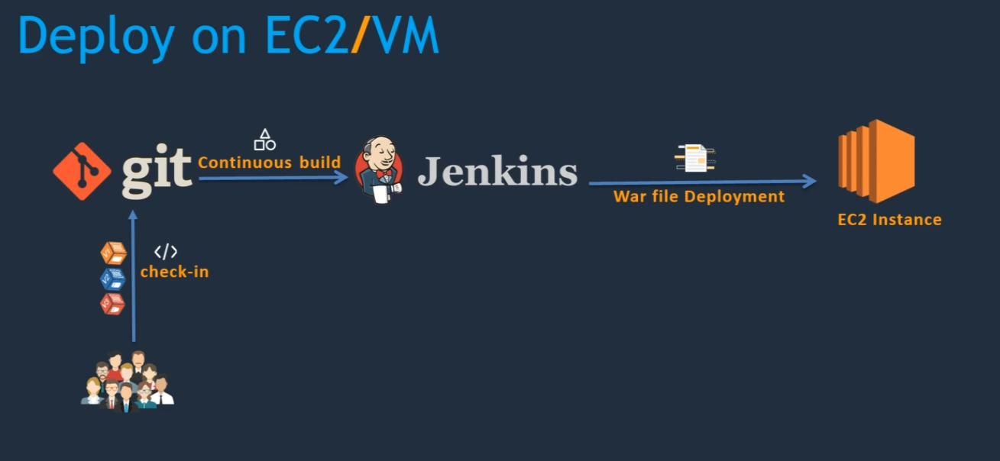
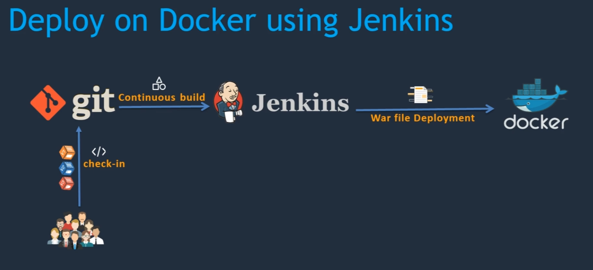
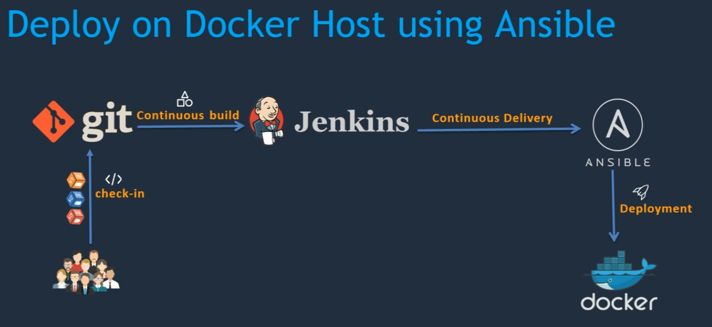
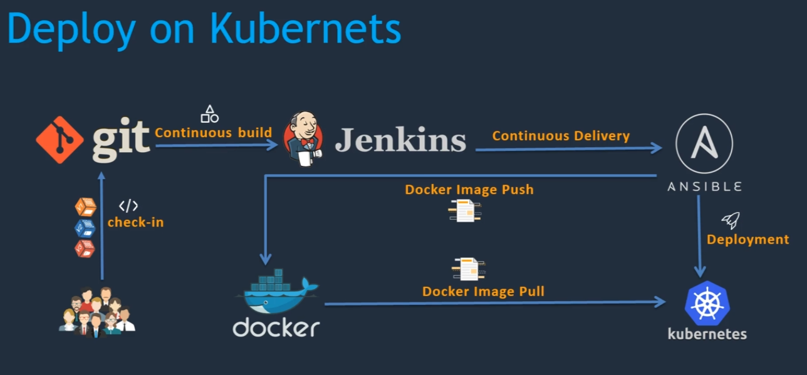
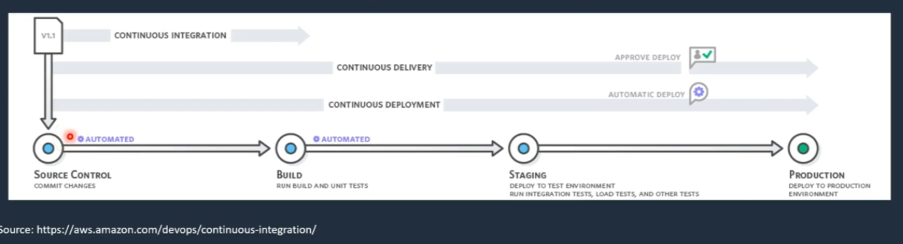
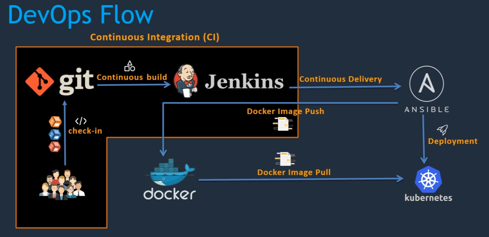
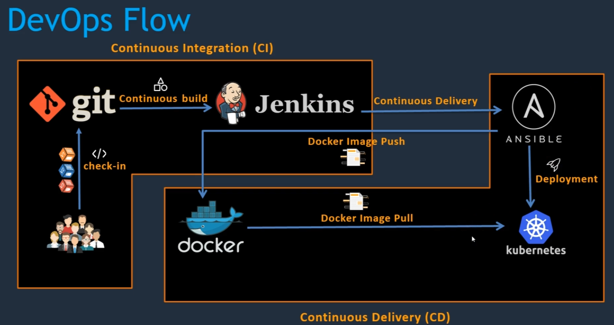
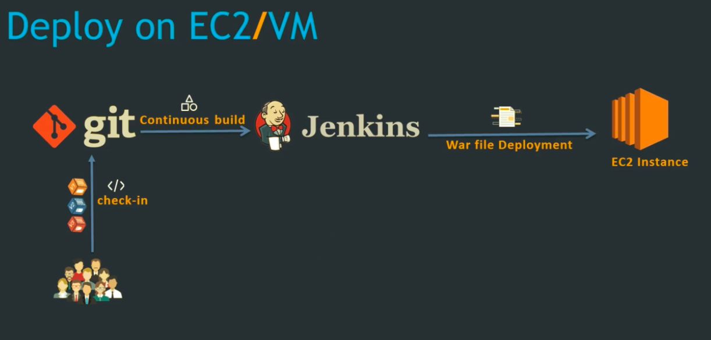
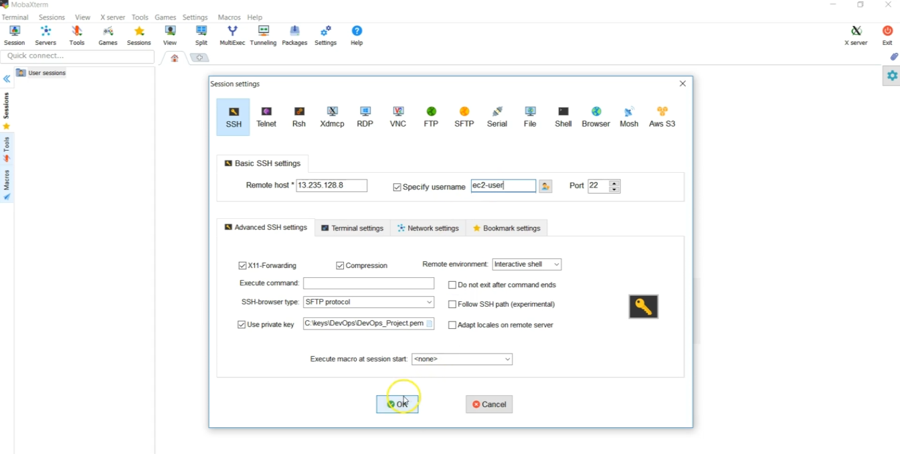

# [simple-devops-project]()

> A simple devops project with the use of Jenkins, Ansible, Docker and Kubernetes.

## Table of Contents

- [simple-devops-project](#simple-devops-project)
  - [Table of Contents](#table-of-contents)
  - [Overview](#overview)
    - [1. Setup CI/CD with Jenkins, Git, Maven and Tomcat](#1-setup-cicd-with-jenkins-git-maven-and-tomcat)
    - [2. Introducing Docker](#2-introducing-docker)
    - [3. Integration with Ansible](#3-integration-with-ansible)
    - [4. Introducing Kubernetes](#4-introducing-kubernetes)
  - [What is CI/CD ?](#what-is-cicd-)
  - [Jenkins Deploy on EC2/VM](#jenkins-deploy-on-ec2vm)
    - [Jenkins Installation](#jenkins-installation)
    - [Creating the Infra using Terraform](#creating-the-infra-using-terraform)
    - [Creating a Job](#creating-a-job)
    - [Github Setup](#github-setup)
    - [Maven Setup](#maven-setup)
  - [Integrating Tomcat server in pipeline](#integrating-tomcat-server-in-pipeline)
    - [Install Tomcat](#install-tomcat)
    - [Integrate Tomcat server with Jenkins](#integrate-tomcat-server-with-jenkins)
    - [Automatic Deploy on Code change](#automatic-deploy-on-code-change)
  - [Integrating Docker in pipeline](#integrating-docker-in-pipeline)
    - [Docker env setup](#docker-env-setup)
    - [Integrating Docker host with Jenkins server](#integrating-docker-host-with-jenkins-server)
  - [Integrating Ansible in pipeline](#integrating-ansible-in-pipeline)
  - [Integrating Kubernetes in pipeline](#integrating-kubernetes-in-pipeline)
  - [License](#license)

## Overview

### 1. Setup CI/CD with Jenkins, Git, Maven and Tomcat

- Setup Jenkins
- Run a test job
- Setup & configure Maven and Git
- Setup Tomcat Server
- Installing additional required plugins
- Integrating Git, Maven in Jenkins job
- Run CI/CD job



### 2. Introducing Docker

- Setting up Docker environment
- Managing Docker with Ansible
- DockerHub repository
- Writing a Docker file
- Run a job



### 3. Integration with Ansible

- Setting up Ansible environment
- Integrating Ansible with Jenkins
- Writing a Ansible playbook to deploy on container
- Run a job



### 4. Introducing Kubernetes

- Setting up Kubernetes environment
- Write deployment and service files
- Run a job



## What is CI/CD ?

- Continuos Integration (CI)
- Continuos Delivery (CD) - There will be a manual intervention to deploy to env
- Continuos Deployment (CD) - No manual intervention
- CI process with result in an artifact which is used in the staging env.



- If this whole process happens without any manual intervention then its continuos deployment.
  



## Jenkins Deploy on EC2/VM

- Jenkins pulls the code from git and deploys the code to EC2 instance running tomcat.



### Jenkins Installation

> The whole documentation for installation can be found [here](jenkins/01.jenkins_installation.MD)

- Go into aws console and create an EC2 instance
- We can use `MobaXterm` or PuTTy to connect to the server, but we don't need to convert the key when using with `MobaXTerm`



```sh
> sudo su - # be the root user
> java -version # we need 1.8
> yum remove java-1.7.0* # remove 1.7
> yum install java-1.8*
```

- We need to download LTS (Long Term Support) version of redhat and fedora version.
- Access jenkins in the browser

```sh
http://YOUR-SERVER-PUBLIC-IP:8080
> cat /var/lib/jenkins/secrets/initialAdminPassword # to find the autogenerated password
```

- Don't need to install jenkins plugins for now. Close it we will install it based on necessities.
- Start using jenkins.
- Change the admin password, `admin` > `configure` > `password` > `apply` 
- Manage jenkins > Global tool configuration > Add JDK
  - Name: `JAVA_HOME`
  - JAVA_HOME: `paste the path`
- `apply` > `save`

```sh
> ssh -o IdentitiesOnly=yes -i key.pem ec2-user@x.x.x.x
> echo $JAVA_HOME #copy the path
```

### Creating the Infra using Terraform

> If you don't want to manually create the ec2 instance, we can run the terraform code.

- Create a s3 bucket manually named `javahome-tf-1212`

```sh
> cd terraform/jenkins-ci/config
> AWS_DEFAULT_REGION=us-east-1 aws ec2 create-key-pair --key-name jenkins --query 'KeyMaterial' --output text > jenkins.pem
```

To provision the infrastructure using terraform,

```sh
> terraform init
> terraform plan 
> terraform apply -auto-approve
> terraform output
```

### Creating a Job

- Go to `New Item` > `Jobs` > Give it a name
- Give some description and for now the source code is `none` since we haven't installed any source code management plugins.
- Build select `execute shell` because our target system is `ubuntu`
- We can `Apply` > `Save`
- If we need to edit it again we can press configure else we can do an initial build.

### Github Setup

> Read documentation on [github jenkins setup](./notes/jenkins/Git_plugin_install.MD).

- The first step of installation can be skipped if we use terraform code to spin up the ec2 instance.

### Maven Setup

> Read documentation on [maven setup](./notes/jenkins/maven_install.MD).

- Sometimes in ubuntu the maven home would be `/usr/share/maven`
- Now, lets create a new item. `MyFirstMavenBuild` > Select `Maven Project`
- To build with maven we need to have source code. Get the git clone url `https://github.com/murshidazher/simple-devops-hello-world.git` of the source code.
- Choose git and provide the repository url.
- Goals: `clean install package`
- Apply and save
- Build now
- Workspace will contain all the files of the repo and the build maven war file can be found in `webapp > target > webapp.war`
- You can find then locally under `cd /var/lib/jenkins/workspace`
- Though we have a war file, we currently don't have any `target environment` to host these files. So we need to setup a tomcat server to host the war file.

## Integrating Tomcat server in pipeline

### Install Tomcat

> Read documentation on [how to setup a tomcat server](./notes/tomcat/01.tomcat_installation.MD).

- We need to create a new `ec2` instance to host the tomcat server.
- We also need to create users so that tomcat server will allows jenkins server to host the war file. So we need to create couple of users and roles.

```sh
> cd terraform/tomcat-server/config
> AWS_DEFAULT_REGION=us-east-1 aws ec2 create-key-pair --key-name tomcat --query 'KeyMaterial' --output text > tomcat.pem
> chmod 400 tomcat.pem
```

To provision the infrastructure using terraform,

```sh
> terraform init
> terraform plan 
> terraform apply -auto-approve
> terraform refresh
> terraform output
```

- Login to the instance and setup the necessary port numbers.
- We need to also add some users in `context.xml` so users can log into the `ManagerApp` tomcat server from outside.
- `find / -name context.xml` and edit the files under `webapps`.


### Integrate Tomcat server with Jenkins

- We need to integrate tomcat server with jenkins for deployment.
- Go to the jenkins serve and to install on vm we need an additional plugin called `deploy to container`. So we need to install it.
- Create a new job to deploy to vm > `new item` > `deploy_on_tomcat_server` > `maven project`
- Choose git and give the repository url. Select `main` branch.
- Goals: `clean install package`
- Since we need to deploy it once successful, we need to add `post-build action` > `deploy war/ear to a container`  > give the war file location > `**/*.war`
- Select `add to container` > `tomcat v8` > to deploy to tomcat server it should accept jenkins credentials. Since we created couple of users we can use those users.
- Give the `deployer` credential and add the tomcat url `http://x.xx.xx.x:8080/` > Apply > Save
- Run the job by pressing `Build now`.
- So now when we run this job it will deploy the war file to tomcat server. The jenkins will copy the files to `/opt/tomcat/webapps/` directory.
- To access the application we need to give the war file name. i.e. `http://x.xx.xx.x:8080/webapp`

### Automatic Deploy on Code change

> How to automatically trigger a new build on code change ?

- Edit `deploy_on_tomcat_server` and configure
- Scroll down and then `Build trigger` section, if we specify `build periodically` then we need to add a cron job.
- `PollSCM` also is like cron job where it will fetch the repository periodically. If there wasnt any changes during that period of time, then it wont trigger that job. `* * * * *` - every minute, every hour, every day, every week, every month it should get executed. If you need to execute once a day around 12'o clock `00 12 * * *`
- Now if we push a code change, it will be automatically triggered.
- Here we are using jenkins as build and deployment tool.

## Integrating Docker in pipeline

> In this instead of deploying it into tomcat server we will deploy it to docker host.

### Docker env setup

- Docker containers are created out of docker images which are created using Dockerfile.
- We can use the images from Dockerhub. If we need to pull images from private repositories then we need to login to docker using `docker login`.

### Integrating Docker host with Jenkins server

- We need to connect jenkins server with docker host server, so that it can transfer the host war files.
- For this purpose we need to install a plugin called `Publish over SSH` in our jenkins server. Then we need to add docker host credentials to the jenkins server so that jenkins server can authenticate itself using this credentials.
- To add docker server credentials in jenkins, we need to create a user called  `dockeradmin` in docker server.
- Now, we need to give the docker credentials in jenkins server. `Manage Jenkins` > `Configure system`

## Integrating Ansible in pipeline

## Integrating Kubernetes in pipeline

## License

MIT c 2021 Murshid Azher
